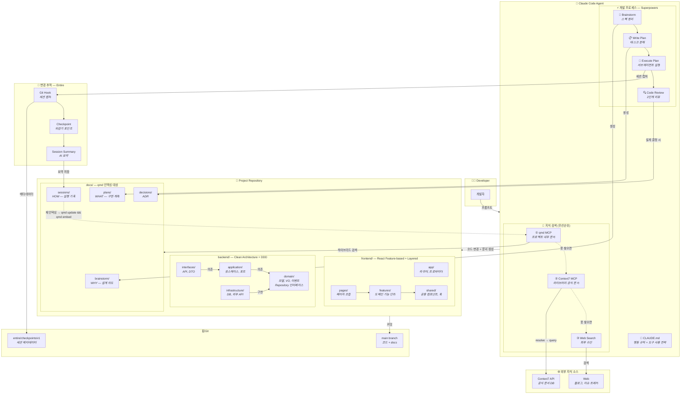
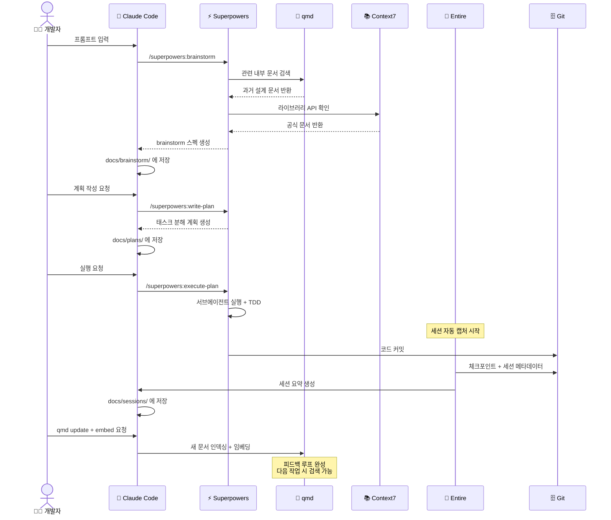

# Claude Code 에이전트 개발 환경 셋업 가이드

> Superpowers + Context7 + qmd + Entire를 통합한 지능형 개발 워크플로우

---

## 1. 전체 아키텍처



### 도구별 역할 요약

| 도구 | 역할 | 담당 영역 |
|------|------|-----------|
| **Superpowers** | 개발 프로세스 | WHY & WHAT — 설계 의도, 스펙, 계획 |
| **Context7** | 외부 지식 | 라이브러리/프레임워크 공식 문서 |
| **qmd** | 내부 지식 검색 | 프로젝트 문서, 과거 결정, 세션 기록 |
| **Entire** | 변경 추적 | HOW — 코드가 왜, 어떻게 바뀌었는지 |

---

## 2. 사전 설치

### 2.1 기본 도구

```bash
# Bun (qmd 런타임)
curl -fsSL https://bun.sh/install | bash

# qmd
bun install -g https://github.com/tobi/qmd

# Entire CLI
brew tap entireio/tap
brew install entireio/tap/entire
```

### 2.2 Claude Code 플러그인 & MCP 설정

```bash
# Superpowers 설치 (Claude Code 세션 안에서 실행)
/plugin marketplace add obra/superpowers-marketplace
/plugin install superpowers@superpowers-marketplace
```

MCP 설정 (`~/.claude/settings.json`):

```json
{
  "mcpServers": {
    "qmd": {
      "command": "qmd",
      "args": ["mcp"]
    },
    "context7": {
      "command": "npx",
      "args": ["-y", "@upstash/context7-mcp"]
    }
  }
}
```

> Context7 API 키가 있다면 `"args": ["-y", "@upstash/context7-mcp", "--api-key", "YOUR_KEY"]`로 설정하거나, `"env": {"CONTEXT7_API_KEY": "YOUR_KEY"}`를 추가하면 rate limit이 완화된다.

---

## 3. 프로젝트 초기화

새 프로젝트 또는 기존 프로젝트에 적용할 때:

```bash
cd your-project

# 1. Entire 활성화
entire enable
# 또는 auto-commit 전략 사용
entire enable --strategy auto-commit

# 2. qmd 인덱싱 (docs 폴더 중심)
qmd collection add ./docs --name docs
qmd context add qmd://docs "프로젝트 설계 문서, brainstorm 스펙, 구현 계획, 에이전트 세션 요약"
qmd embed

# 3. CLAUDE.md 생성 (아래 섹션 참고)

# 4. docs 디렉토리 구조 생성
mkdir -p docs/{brainstorm,plans,sessions,decisions}
```

---

## 4. CLAUDE.md 작성

CLAUDE.md는 에이전트의 행동 규칙을 정의하는 파일이다. 프로젝트 루트에 위치하며, Claude Code가 작업을 시작할 때 자동으로 읽는다.

### 4.1 CLAUDE.md 구조 원칙

CLAUDE.md에 들어가야 하는 것:
- 프로젝트 컨텍스트 (기술 스택, 아키텍처)
- 도구 사용 규칙 (언제 어떤 도구를 쓸지)
- 코딩 컨벤션
- 금지 사항

CLAUDE.md에 들어가지 않아야 하는 것:
- MCP 서버 설정 (settings.json에 분리)
- Superpowers 플러그인 설정 (플러그인 자체가 관리)
- 일반적인 코딩 상식

### 4.2 CLAUDE.md 템플릿

[CLAUDE.md Template](./docs/claude-template.md)

---

## 5. 일상 워크플로우



### 5.1 새로운 기능 개발

```bash
# 1. Claude Code 시작
claude

# 2. Superpowers로 brainstorm
> /superpowers:brainstorm 결제 도메인에 환불 기능을 추가하려고 해

# → 에이전트가 qmd로 기존 결제 관련 설계 문서 검색
# → Context7으로 사용 중인 PG 라이브러리 API 확인
# → docs/brainstorm/2026-02-18-refund.md 생성

# 3. 구현 계획 작성
> /superpowers:write-plan

# → docs/plans/2026-02-18-refund-plan.md 생성

# 4. 실행
> /superpowers:execute-plan

# → Entire가 전체 세션 캡처
# → 커밋 시 체크포인트 자동 생성

# 5. 작업 완료 후 인덱스 갱신
> "qmd update && qmd embed 실행해서 새 문서 인덱싱해줘"
```

### 5.2 기존 코드 수정 / 디버깅

```bash
> "결제 타임아웃 에러가 발생하고 있어. 관련 설계 문서 먼저 확인해줘"

# → 에이전트가 qmd로 "결제 타임아웃" 검색
# → 과거 brainstorm이나 세션 기록에서 관련 맥락 파악
# → Context7으로 HTTP 클라이언트 타임아웃 설정 공식 문서 참조
# → 수정 진행 + Entire 체크포인트
```

### 5.3 Entire 세션 → 문서화 (선택)

Entire 세션 요약을 docs에 자동으로 남기고 싶다면 `.entire/settings.json`에서 summarize를 활성화한다:

```json
{
  "strategy": "manual-commit",
  "agent": "claude-code",
  "enabled": true,
  "strategy_options": {
    "summarize": {
      "enabled": true
    }
  }
}
```

세션 요약을 `docs/sessions/`로 옮기는 건 Git hook이나 간단한 스크립트로 자동화할 수 있다.

---

## 6. 디렉토리 구조 최종 형태

```
your-project/
├── CLAUDE.md                    # 에이전트 행동 규칙
├── .entire/                     # Entire 설정
│   ├── settings.json
│   └── local.json
├── docs/                        # qmd 인덱싱 대상
│   ├── brainstorm/              # Superpowers brainstorm 결과
│   ├── plans/                   # Superpowers 구현 계획
│   ├── sessions/                # Entire 세션 요약
│   └── decisions/               # ADR (Architecture Decision Records)
├── backend/
│   ├── domain/
│   │   ├── model/
│   │   ├── service/
│   │   ├── event/
│   │   └── repository/
│   ├── application/
│   │   ├── usecase/
│   │   ├── port/
│   │   └── dto/
│   ├── interfaces/
│   │   ├── api/
│   │   ├── event/
│   │   └── dto/
│   └── infrastructure/
│       ├── persistence/
│       ├── external/
│       ├── messaging/
│       └── config/
├── frontend/
│   └── src/
│       ├── app/                 # 라우터, 프로바이더
│       ├── pages/               # 페이지 조합
│       ├── features/            # 도메인 기능 단위
│       │   └── [feature-name]/
│       │       ├── api/
│       │       ├── components/
│       │       ├── hooks/
│       │       ├── stores/
│       │       ├── types/
│       │       └── index.ts
│       ├── shared/              # 공용 컴포넌트, 훅, 유틸
│       └── styles/
└── .gitignore
```

> 모노레포/멀티레포 여부에 따라 backend/frontend 위치는 조정한다.
> 백엔드 디렉토리 구조는 언어에 따라 패키지/모듈 형태가 달라지지만, 레이어 분리 원칙은 동일하다.

---

## 7. .gitignore 추가 항목

```gitignore
# qmd 로컬 인덱스 (각자 환경에서 rebuild)
.qmd/
```

> Entire의 체크포인트 데이터는 별도 브랜치(`entire/checkpoints/v1`)에 저장되므로 .gitignore 설정이 필요 없다.

---

## 8. 체크리스트

- [ ] qmd 설치 (`bun install -g https://github.com/tobi/qmd`)
- [ ] Entire CLI 설치 (`brew install entireio/tap/entire`)
- [ ] Claude Code MCP 설정 (qmd + Context7)
- [ ] Superpowers 플러그인 설치
- [ ] 프로젝트에서 `entire enable` 실행
- [ ] `docs/` 디렉토리 구조 생성
- [ ] `qmd collection add ./docs --name docs && qmd embed` 실행
- [ ] CLAUDE.md 작성
- [ ] 첫 brainstorm으로 동작 확인
