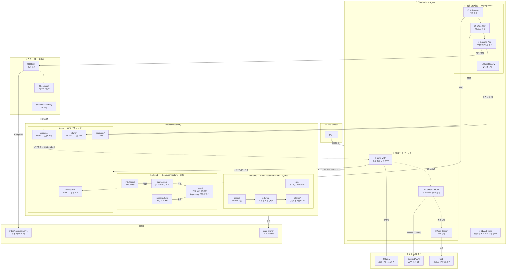
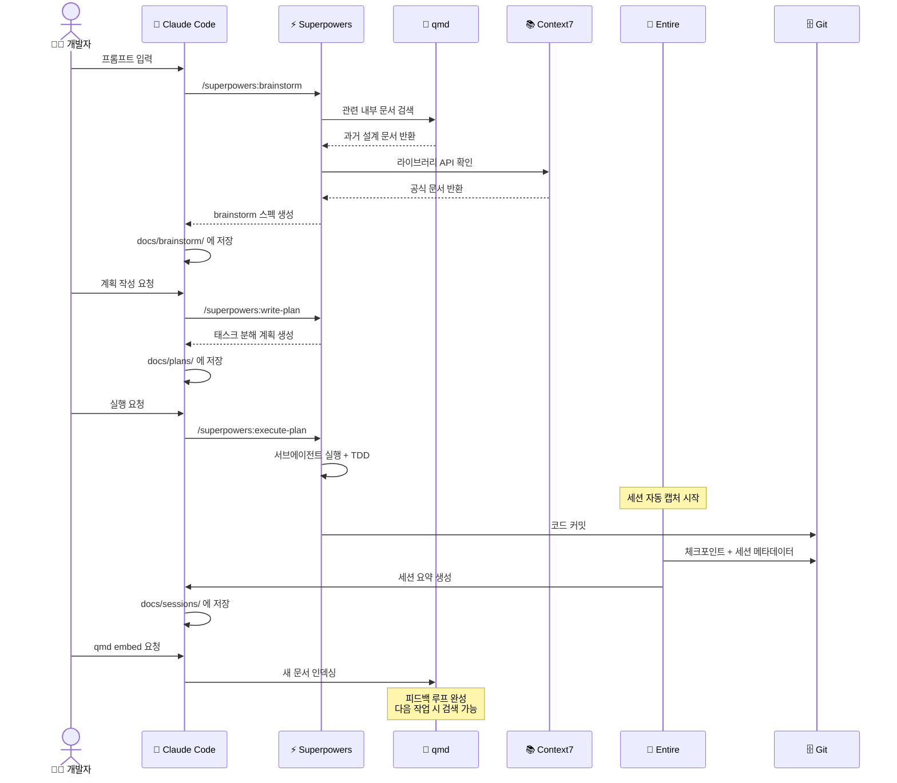

# Claude Code 에이전트 개발 환경 셋업 가이드

> Superpowers + Context7 + qmd + Entire를 통합한 지능형 개발 워크플로우

---

## 1. 전체 아키텍처



### 도구별 역할 요약

| 도구 | 역할 | 담당 영역 |
|------|------|-----------|
| **Superpowers** | 개발 프로세스 | WHY & WHAT — 설계 의도, 스펙, 계획 |
| **Context7** | 외부 지식 | 라이브러리/프레임워크 공식 문서 |
| **qmd** | 내부 지식 검색 | 프로젝트 문서, 과거 결정, 세션 기록 |
| **Entire** | 변경 추적 | HOW — 코드가 왜, 어떻게 바뀌었는지 |

---

## 2. 사전 설치

### 2.1 기본 도구

```bash
# Bun (qmd 런타임)
curl -fsSL https://bun.sh/install | bash

# Ollama (qmd 로컬 AI 모델)
brew install ollama
ollama serve

# qmd
bun install -g https://github.com/tobi/qmd

# Entire CLI
brew tap entireio/tap
brew install entireio/tap/entire
```

### 2.2 Claude Code 플러그인 & MCP 설정

```bash
# Superpowers 설치
claude /plugin marketplace add obra/superpowers-marketplace
claude /plugin install superpowers@superpowers-marketplace
```

MCP 설정 (`~/.claude/settings.json`):

```json
{
  "mcpServers": {
    "qmd": {
      "command": "qmd",
      "args": ["mcp"]
    },
    "context7": {
      "command": "npx",
      "args": ["-y", "@upstash/context7-mcp"]
    }
  }
}
```

> Context7 API 키가 있다면 `"args": ["-y", "@upstash/context7-mcp", "--api-key", "YOUR_KEY"]`로 설정하면 rate limit이 완화된다.

---

## 3. 프로젝트 초기화

새 프로젝트 또는 기존 프로젝트에 적용할 때:

```bash
cd your-project

# 1. Entire 활성화
entire enable
# 또는 auto-commit 전략 사용
entire enable --strategy auto-commit

# 2. qmd 인덱싱 (docs 폴더 중심)
qmd add ./docs
qmd add-context ./docs "프로젝트 설계 문서, brainstorm 스펙, 구현 계획, 에이전트 세션 요약"
qmd embed

# 3. CLAUDE.md 생성 (아래 섹션 참고)

# 4. docs 디렉토리 구조 생성
mkdir -p docs/{brainstorm,plans,sessions,decisions}
```

---

## 4. CLAUDE.md 작성

CLAUDE.md는 에이전트의 행동 규칙을 정의하는 파일이다. 프로젝트 루트에 위치하며, Claude Code가 작업을 시작할 때 자동으로 읽는다.

### 4.1 CLAUDE.md 구조 원칙

CLAUDE.md에 들어가야 하는 것:
- 프로젝트 컨텍스트 (기술 스택, 아키텍처)
- 도구 사용 규칙 (언제 어떤 도구를 쓸지)
- 코딩 컨벤션
- 금지 사항

CLAUDE.md에 들어가지 않아야 하는 것:
- MCP 서버 설정 (settings.json에 분리)
- Superpowers 플러그인 설정 (플러그인 자체가 관리)
- 일반적인 코딩 상식

### 4.2 CLAUDE.md 템플릿

```markdown
# Project: [프로젝트명]

## Overview

[프로젝트 한 줄 설명]

- Tech Stack: [사용 언어/프레임워크를 여기에 명시]
- Build: [빌드 도구]

## Knowledge Retrieval Strategy

이 프로젝트에서 정보를 찾을 때 다음 우선순위를 따른다:

````mermaid
flowchart TD
    NEED["🤔 정보가 필요함"] --> Q1{"프로젝트 내부 문서에<br/>있을 수 있는가?"}

    Q1 -->|Yes| QMD["① qmd MCP 검색<br/><i>docs/ 디렉토리</i>"]
    QMD --> FOUND1{"찾았는가?"}
    FOUND1 -->|Yes| DONE["✅ 응답에 활용"]
    FOUND1 -->|No| Q2

    Q1 -->|No| Q2{"라이브러리/프레임워크<br/>API 문서가 필요한가?"}

    Q2 -->|Yes| C7["② Context7 MCP<br/><i>공식 문서 조회</i>"]
    C7 --> FOUND2{"찾았는가?"}
    FOUND2 -->|Yes| DONE
    FOUND2 -->|No| WEB

    Q2 -->|No| WEB["③ Web Search<br/><i>최후 수단</i>"]
    WEB --> DONE

    style QMD fill:#1a4731,stroke:#34d399,stroke-width:2px,color:#e0e0e0
    style C7 fill:#1e3a5f,stroke:#38bdf8,stroke-width:2px,color:#e0e0e0
    style WEB fill:#5c2d0e,stroke:#f59e0b,stroke-width:2px,color:#e0e0e0
    style DONE fill:#2d1b69,stroke:#8b5cf6,stroke-width:2px,color:#e0e0e0
````

1. **프로젝트 내부 문서 (qmd)**: 설계 결정, 과거 brainstorm, 구현 계획, 세션 로그
   - `docs/` 디렉토리가 qmd로 인덱싱되어 있다
   - 과거 의사결정이나 프로젝트 컨텍스트가 필요하면 qmd MCP로 먼저 검색한다
   - 예: "인증 구조를 왜 이렇게 설계했지?" → qmd 검색

2. **외부 라이브러리 문서 (Context7)**: 프레임워크/라이브러리 API, 설정 방법
   - 라이브러리 사용법이나 API가 필요하면 Context7 MCP를 사용한다
   - web search보다 Context7을 우선한다
   - 예: "Spring Security OAuth2 설정" → Context7으로 공식 문서 조회

3. **Web Search**: Context7에 없는 최신 정보, 블로그, 이슈 트래커
   - 위 두 가지로 해결되지 않을 때만 사용한다

## Documentation Rules

### 생성되는 문서 위치

- `docs/brainstorm/` — brainstorm 결과물 (스펙, 요구사항 정리)
- `docs/plans/` — 구현 계획 (태스크 분해)
- `docs/sessions/` — 에이전트 세션 요약 (Entire 세션 기반)
- `docs/decisions/` — 아키텍처 의사결정 기록 (ADR)

### 문서 작성 규칙

- 모든 brainstorm, plan 문서는 `docs/` 하위에 마크다운으로 저장한다
- 파일명 형식: `YYYY-MM-DD-[주제].md` (예: `2026-02-18-auth-redesign.md`)
- 중요한 설계 결정을 내릴 때는 `docs/decisions/`에 ADR을 작성한다
- 작업 완료 후 qmd 인덱스 갱신을 안내한다: `qmd embed`

---

## Architecture Principles

### Backend: Clean Architecture + DDD + 책임주도설계

이 프로젝트의 백엔드는 특정 언어나 프레임워크에 종속되지 않는 설계 원칙을 따른다.
언어/프레임워크가 바뀌더라도 아래 원칙은 동일하게 적용한다.

#### 레이어 구조 (Clean Architecture)

````mermaid
graph LR
    subgraph OUTER["Outer Layer"]
        INFRA["🔧 Infrastructure<br/><i>DB, 외부 API, 메시징<br/>프레임워크 설정</i>"]
        INTF["🔌 Interface / Adapter<br/><i>REST/gRPC 컨트롤러<br/>이벤트 리스너, DTO 변환</i>"]
    end

    subgraph INNER["Inner Layer"]
        APP["⚙️ Application<br/><i>유스케이스, 커맨드/쿼리 핸들러<br/>포트 정의</i>"]
        DOMAIN["💎 Domain<br/><i>엔티티, VO, 도메인 서비스<br/>도메인 이벤트, Repository 인터페이스</i>"]
    end

    INTF -->|의존| APP -->|의존| DOMAIN
    INFRA -->|구현| DOMAIN

    style DOMAIN fill:#1a4731,stroke:#34d399,stroke-width:2px,color:#e0e0e0
    style APP fill:#1e3a5f,stroke:#38bdf8,stroke-width:2px,color:#e0e0e0
    style INTF fill:#2d1b69,stroke:#8b5cf6,stroke-width:2px,color:#e0e0e0
    style INFRA fill:#5c2d0e,stroke:#f59e0b,stroke-width:2px,color:#e0e0e0
````

의존성 방향은 항상 바깥 → 안쪽이다. Domain은 어떤 외부 레이어도 참조하지 않는다.

#### 디렉토리 구조

````
backend/
├── domain/
│   ├── model/            # 엔티티, VO, Aggregate Root
│   ├── service/          # 도메인 서비스 (비즈니스 규칙)
│   ├── event/            # 도메인 이벤트
│   └── repository/       # Repository 인터페이스 (포트)
├── application/
│   ├── usecase/          # 유스케이스 (커맨드/쿼리 핸들러)
│   ├── port/             # 인바운드/아웃바운드 포트
│   └── dto/              # Application 레벨 DTO
├── interfaces/
│   ├── api/              # REST/gRPC 컨트롤러
│   ├── event/            # 이벤트 리스너/퍼블리셔
│   └── dto/              # 요청/응답 DTO
└── infrastructure/
    ├── persistence/      # Repository 구현체, ORM 매핑
    ├── external/         # 외부 API 클라이언트
    ├── messaging/        # 메시지 브로커 연동
    └── config/           # 프레임워크/인프라 설정
````

#### Domain-Driven Design

- Bounded Context를 먼저 식별하고, 컨텍스트 간 경계를 명확히 한다
- Aggregate Root를 통해서만 Aggregate 내부 엔티티에 접근한다
- 도메인 로직은 반드시 Domain 레이어에 위치한다. Application 레이어에 비즈니스 규칙을 넣지 않는다
- Ubiquitous Language를 사용한다. 코드의 클래스명, 메서드명이 도메인 전문가와 소통하는 언어와 일치해야 한다
- 컨텍스트 간 통신은 도메인 이벤트를 통한 비동기 방식을 기본으로 한다

#### 책임주도설계 (Responsibility-Driven Design)

- 객체에게 역할(Role)과 책임(Responsibility)을 먼저 할당하고, 그 다음에 구현한다
- 새로운 기능을 설계할 때 "이 행위의 책임을 누가 져야 하는가?"를 먼저 묻는다
- 객체는 자신의 상태를 스스로 관리한다. 외부에서 getter로 상태를 꺼내서 판단하지 않는다 (Tell, Don't Ask)
- 하나의 객체가 너무 많은 책임을 가지면 분리한다 (SRP)
- 협력(Collaboration)을 설계한다: 객체 간 메시지 전송 흐름을 먼저 그리고, 그에 맞는 인터페이스를 정의한다

#### 설계 규칙

- 불변 객체를 기본으로 한다. 상태 변경이 필요하면 새 인스턴스를 반환한다
- 생성자에서 유효성을 검증한다. 잘못된 상태의 객체가 존재할 수 없게 한다
- 매직 넘버/스트링을 금지한다. 상수, enum, 또는 VO로 표현한다
- 외부 의존성은 인터페이스(포트)로 추상화하고, Infrastructure에서 구현한다
- 에러 처리는 언어의 타입 시스템을 활용한다 (Result 타입, sealed class, union type 등)
- 외부 API 호출은 Circuit Breaker 패턴을 적용한다
- 환경별 설정값을 코드에 하드코딩하지 않는다

### Frontend: React Feature-based + Layered Architecture

#### 레이어 구조

````mermaid
graph LR
    subgraph APP_LAYER["App Layer"]
        APP["🚀 app/<br/><i>라우터, 프로바이더<br/>글로벌 설정</i>"]
        PAGES["📄 pages/<br/><i>페이지 조합</i>"]
    end

    subgraph FEATURE_LAYER["Feature Layer"]
        FEAT["🧩 features/<br/><i>도메인 기능 단위<br/>api / components / hooks<br/>stores / types</i>"]
    end

    subgraph SHARED_LAYER["Shared Layer"]
        SHARED["🔗 shared/<br/><i>공용 컴포넌트, 훅<br/>유틸리티, 타입, 상수</i>"]
    end

    APP --> PAGES --> FEAT --> SHARED
    FEAT -.->|"❌ feature 간<br/>직접 참조 금지"| FEAT

    style SHARED fill:#1a4731,stroke:#34d399,stroke-width:2px,color:#e0e0e0
    style FEAT fill:#1e3a5f,stroke:#38bdf8,stroke-width:2px,color:#e0e0e0
    style PAGES fill:#2d1b69,stroke:#8b5cf6,stroke-width:2px,color:#e0e0e0
    style APP fill:#5c2d0e,stroke:#f59e0b,stroke-width:2px,color:#e0e0e0
````

#### 디렉토리 구조

````
frontend/
├── src/
│   ├── app/                    # 앱 진입점, 라우터, 글로벌 프로바이더
│   │   ├── routes/
│   │   ├── providers/
│   │   └── App.tsx
│   ├── pages/                  # 페이지 컴포넌트 (feature 조합)
│   │   └── DashboardPage.tsx
│   ├── features/               # 도메인 기능 단위
│   │   └── [feature-name]/
│   │       ├── api/            # API 호출, 쿼리/뮤테이션
│   │       ├── components/     # feature 전용 UI 컴포넌트
│   │       ├── hooks/          # feature 전용 커스텀 훅
│   │       ├── stores/         # feature 전용 상태 관리
│   │       ├── types/          # feature 전용 타입
│   │       ├── utils/          # feature 전용 유틸리티
│   │       └── index.ts        # public API (배럴 파일)
│   ├── shared/                 # 공유 모듈
│   │   ├── components/         # 범용 UI 컴포넌트 (Button, Modal, ...)
│   │   ├── hooks/              # 공용 커스텀 훅
│   │   ├── types/              # 공용 타입/인터페이스
│   │   ├── utils/              # 공용 유틸리티
│   │   └── constants/          # 공용 상수
│   └── styles/                 # 글로벌 스타일, 테마
└── public/
````

#### Feature 설계 규칙

- Feature는 하나의 비즈니스 도메인을 대표한다 (예: `auth`, `payment`, `notification`)
- Feature 간 직접 참조를 금지한다. feature 간 통신이 필요하면 shared를 경유하거나 이벤트를 사용한다
- 각 feature의 `index.ts`가 public API다. 외부에서는 `index.ts`를 통해서만 접근한다
- 컴포넌트는 Presentational / Container 패턴 또는 Hooks 패턴으로 로직과 UI를 분리한다
- API 호출 로직은 feature의 `api/` 디렉토리에 격리한다. 컴포넌트에서 직접 fetch하지 않는다
- 서버 상태는 React Query(TanStack Query) 등 서버 상태 관리 라이브러리로 관리한다
- 클라이언트 상태는 최소화한다. 필요한 경우 feature-scoped store를 사용한다

#### 컴포넌트 설계 규칙

- 컴포넌트는 단일 책임을 가진다. 200줄을 넘기면 분리를 검토한다
- Props drilling이 3단계를 넘기면 Context 또는 상태 관리 도입을 검토한다
- side effect는 커스텀 훅으로 추출한다
- 재사용 가능한 UI 로직은 `shared/hooks/`로, feature 전용 로직은 `features/[name]/hooks/`로 분리한다

---

## Naming Conventions

### Backend

- Command: `Create[Entity]Command`, `Update[Entity]Command`
- Query: `Get[Entity]Query`, `Find[Entity]sQuery`
- Event: `[Entity][PastTense]Event` (예: `OrderCreatedEvent`)
- UseCase / Handler: `[Command/Query]Handler` 또는 `[Action][Entity]UseCase`
- Repository: `[Entity]Repository` (인터페이스), `[Entity]RepositoryImpl` (구현체)
- VO: 의미를 드러내는 이름 (예: `Money`, `Email`, `OrderId`)

### Frontend

- Component: PascalCase (예: `PaymentForm.tsx`)
- Hook: `use` prefix + camelCase (예: `usePaymentStatus.ts`)
- Store: camelCase + `Store` suffix (예: `paymentStore.ts`)
- Type: PascalCase (예: `PaymentResponse`)
- Util: camelCase (예: `formatCurrency.ts`)
- 디렉토리: kebab-case (예: `features/order-management/`)

---

## Testing

- 테스트 먼저 작성한다 (TDD: Red → Green → Refactor)
- Backend: 도메인 로직 단위 테스트를 가장 두텁게, 통합 테스트는 주요 유스케이스 중심
- Frontend: 커스텀 훅과 유틸리티 함수의 단위 테스트, 주요 사용자 흐름의 통합 테스트
- 테스트 메서드명에 한글을 허용한다. 의도를 명확히 표현하는 것이 우선이다
- 외부 의존성은 테스트 더블(Mock, Stub, Fake)로 대체한다

---

## Git Workflow

- 작업 브랜치: `feature/[작업명]`, `fix/[이슈명]`
- 커밋 메시지: Conventional Commits (`feat:`, `fix:`, `refactor:`, `docs:`)
- Entire가 세션을 추적 중이므로 커밋 시 자동으로 체크포인트가 생성된다
- 실험적 시도는 Entire 체크포인트를 활용해 안전하게 되돌릴 수 있다

---

## Constraints

- 프로덕션 코드에 콘솔 출력(println, console.log) 금지. 구조화된 Logger를 사용한다
- 환경 변수로 관리해야 하는 값을 하드코딩하지 않는다
- 사용하지 않는 코드(dead code)를 남겨두지 않는다
- 주석으로 코드를 설명하기보다 코드 자체가 의도를 드러내게 작성한다. 주석은 "왜(why)"를 설명할 때만 사용한다
```

---

## 5. 일상 워크플로우



### 5.1 새로운 기능 개발

```bash
# 1. Claude Code 시작
claude

# 2. Superpowers로 brainstorm
> /superpowers:brainstorm 결제 도메인에 환불 기능을 추가하려고 해

# → 에이전트가 qmd로 기존 결제 관련 설계 문서 검색
# → Context7으로 사용 중인 PG 라이브러리 API 확인
# → docs/brainstorm/2026-02-18-refund.md 생성

# 3. 구현 계획 작성
> /superpowers:write-plan

# → docs/plans/2026-02-18-refund-plan.md 생성

# 4. 실행
> /superpowers:execute-plan

# → Entire가 전체 세션 캡처
# → 커밋 시 체크포인트 자동 생성

# 5. 작업 완료 후 인덱스 갱신
> "qmd embed 실행해서 새 문서 인덱싱해줘"
```

### 5.2 기존 코드 수정 / 디버깅

```bash
> "결제 타임아웃 에러가 발생하고 있어. 관련 설계 문서 먼저 확인해줘"

# → 에이전트가 qmd로 "결제 타임아웃" 검색
# → 과거 brainstorm이나 세션 기록에서 관련 맥락 파악
# → Context7으로 HTTP 클라이언트 타임아웃 설정 공식 문서 참조
# → 수정 진행 + Entire 체크포인트
```

### 5.3 Entire 세션 → 문서화 (선택)

Entire 세션 요약을 docs에 자동으로 남기고 싶다면 `.entire/settings.json`에서 summarize를 활성화한다:

```json
{
  "strategy": "manual-commit",
  "agent": "claude-code",
  "enabled": true,
  "strategy_options": {
    "summarize": {
      "enabled": true
    }
  }
}
```

세션 요약을 `docs/sessions/`로 옮기는 건 Git hook이나 간단한 스크립트로 자동화할 수 있다.

---

## 6. 디렉토리 구조 최종 형태

```
your-project/
├── CLAUDE.md                    # 에이전트 행동 규칙
├── .entire/                     # Entire 설정
│   ├── settings.json
│   └── local.json
├── docs/                        # qmd 인덱싱 대상
│   ├── brainstorm/              # Superpowers brainstorm 결과
│   ├── plans/                   # Superpowers 구현 계획
│   ├── sessions/                # Entire 세션 요약
│   └── decisions/               # ADR (Architecture Decision Records)
├── backend/
│   ├── domain/
│   │   ├── model/
│   │   ├── service/
│   │   ├── event/
│   │   └── repository/
│   ├── application/
│   │   ├── usecase/
│   │   ├── port/
│   │   └── dto/
│   ├── interfaces/
│   │   ├── api/
│   │   ├── event/
│   │   └── dto/
│   └── infrastructure/
│       ├── persistence/
│       ├── external/
│       ├── messaging/
│       └── config/
├── frontend/
│   └── src/
│       ├── app/                 # 라우터, 프로바이더
│       ├── pages/               # 페이지 조합
│       ├── features/            # 도메인 기능 단위
│       │   └── [feature-name]/
│       │       ├── api/
│       │       ├── components/
│       │       ├── hooks/
│       │       ├── stores/
│       │       ├── types/
│       │       └── index.ts
│       ├── shared/              # 공용 컴포넌트, 훅, 유틸
│       └── styles/
└── .gitignore
```

> 모노레포/멀티레포 여부에 따라 backend/frontend 위치는 조정한다.
> 백엔드 디렉토리 구조는 언어에 따라 패키지/모듈 형태가 달라지지만, 레이어 분리 원칙은 동일하다.

---

## 7. .gitignore 추가 항목

```gitignore
# qmd 로컬 인덱스 (각자 환경에서 rebuild)
.qmd/
```

> Entire의 체크포인트 데이터는 별도 브랜치(`entire/checkpoints/v1`)에 저장되므로 .gitignore 설정이 필요 없다.

---

## 8. 체크리스트

- [ ] Ollama 설치 및 실행 (`ollama serve`)
- [ ] qmd 설치 (`bun install -g https://github.com/tobi/qmd`)
- [ ] Entire CLI 설치 (`brew install entireio/tap/entire`)
- [ ] Claude Code MCP 설정 (qmd + Context7)
- [ ] Superpowers 플러그인 설치
- [ ] 프로젝트에서 `entire enable` 실행
- [ ] `docs/` 디렉토리 구조 생성
- [ ] `qmd add ./docs && qmd embed` 실행
- [ ] CLAUDE.md 작성
- [ ] 첫 brainstorm으로 동작 확인
